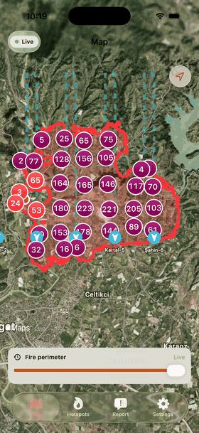
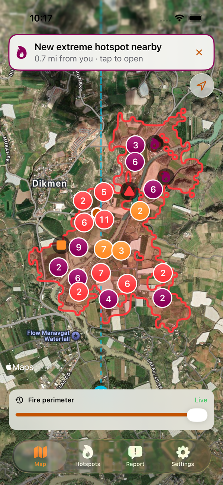
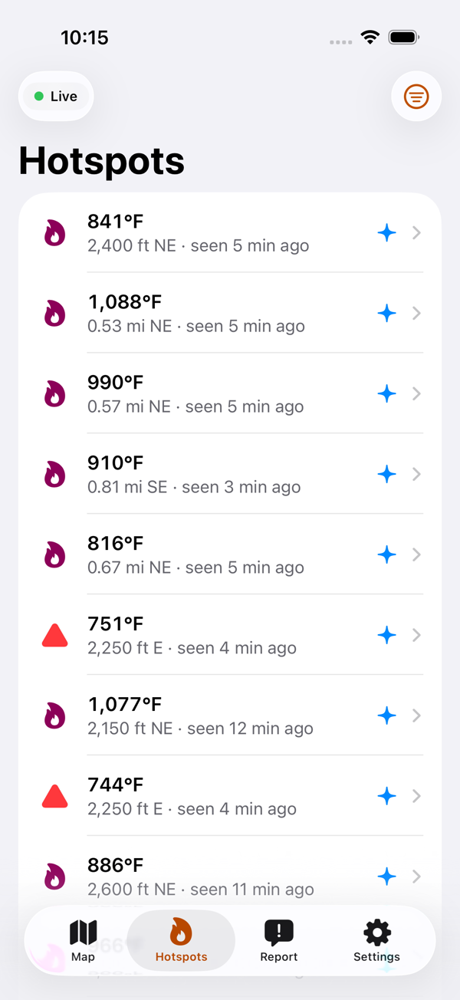
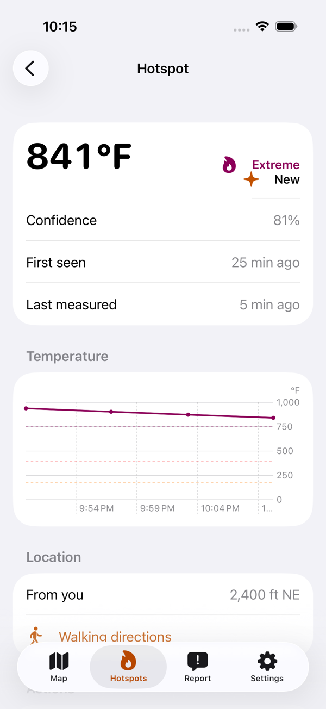
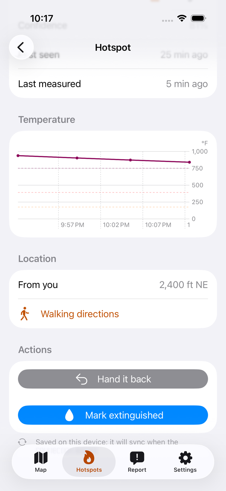
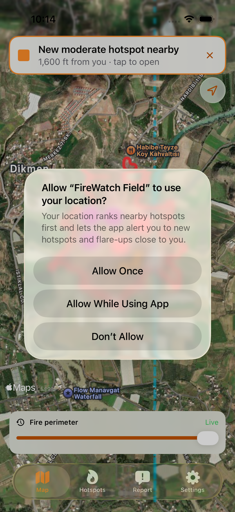

# FireWatch Field

[](https://github.com/ysaatci/firewatch-field/actions/workflows/ci-linux.yml)
[](https://github.com/ysaatci/firewatch-field/actions/workflows/ci-ios.yml)

An iOS app for wildfire ground crews. It shows the hotspots that survey drones find and the
live fire perimeter, ranks hotspots by urgency, lets crews work them from *new* to *verified
cold*, and keeps working with no signal.

<p align="center">
  
  
  
</p>
<p align="center">
  
  
  
</p>

It is the field companion to FireWatch, a drone-based wildfire detection system in
development. Until that pipeline exists, the data comes from a **deterministic wildfire
simulator written in Swift**, which speaks the same API contract the real system will.

**Built entirely without a Mac.** Everything except the SwiftUI layer builds and is tested
on Linux in Docker; the app itself is built, tested, screenshotted and screen-recorded on
GitHub's macOS runners. The screenshots above come from CI.

## What it does

- **Map**: satellite map of hotspots (severity shown by colour *and* shape), clustered when
  zoomed out; the fire perimeter with a timeline to scrub back through its growth; drones
  with their heading and recent track.
- **Ranked list**: hotspots ordered by heat, how recently they were measured and distance
  from you, with filters.
- **Workflow**: take a hotspot, mark it extinguished, verify it cold. A drone measuring it
  hot again flares it up and puts it back in the queue.
- **Offline first**: actions and sighting reports are saved on the phone and sent in order
  when signal returns, surviving the app being killed. You see their effect immediately.
- **Alerts**: new hotspots and flare-ups near you, as a banner or a notification that opens
  the hotspot.
- **Sighting reports** with an optional photo, stripped of everything but its GPS position.
- **Settings**: demo or server data, alert radius, metric or imperial units, and a switch
  that simulates losing signal, so the offline queue can be seen working.
- English and Turkish, Dynamic Type, VoiceOver labels, dark mode.

## How it's built

```
FireWatchSimulator ─► FireWatchServer ─REST/WS─► ServerFeed ─────┐
        │                                                        ├─► FeedStore ─► AppModel ─► SwiftUI
        └─── in-process, demo mode ─────────────► SimulatedFeed ─┘      │
                                                                     Outbox ──► server
                                                                        │
                                                                     SwiftData
```

| Module | What | Runs on |
|---|---|---|
| `FireWatchCore` | Domain model, hotspot workflow state machine, the shared `FireState` reducer, ranking, alerts, and the client engine: feed store, persistent outbox, reconnecting socket | Linux, iOS |
| `FireWatchSimulator` | Seeded wildfire: terrain from fractal noise, cellular-automaton spread with wind and slope, smouldering hotspots, drone survey routes | Linux, iOS |
| `FireWatchAPI` | Versioned wire contract and GeoJSON types, shared by server and app | Linux, iOS |
| `FireWatchClient` | HTTP client and the server-backed feed | Linux, iOS |
| `Server/` | Vapor server replaying the simulator: REST, WebSocket stream, replay control, fault injection | Linux (Docker) |
| `App/` | SwiftUI app, SwiftData persistence, MapKit, Swift Charts | iOS 17+ |

Some of the decisions behind it (all in [docs/decisions](docs/decisions/README.md)):

- **Actions, not statuses, sync.** Crews send *assign* or *extinguish*; the server applies
  each only if it is still legal from the hotspot's current status. Offline, the app replays
  pending actions over the latest server state. A crew that marks a hotspot cold while a
  drone saw it flare up gets the flare-up, not a false "cold" ([D9](docs/decisions/0009-offline-first-outbox-replaying-actions.md)).
- **One reducer everywhere.** Server, app and tests fold the same event stream with the same
  code, and the reducer is idempotent, so reconnect races can't corrupt state ([D15](docs/decisions/0015-idempotent-reducer-and-resnapshot-on-reconnect.md)).
- **Deterministic fake data.** The same seed gives the same fire, byte for byte, so tests and
  screenshots are reproducible ([D4](docs/decisions/0004-deterministic-seeded-fake-data-instead-of-random.md)).
- **Swift 6 strict concurrency** throughout, with actors for the feed store, outbox and
  sessions.

## Tests

- ~250 Swift Testing tests on Linux across Core, Simulator, API, Client and Server,
  including an end-to-end test of the client stack against the real server. Core line
  coverage is gated at 80 % in CI (currently 97 %).
- On the iOS simulator: unit tests, snapshot tests in light, dark, the largest
  accessibility text size, English and Turkish, UI tests for each main flow (including
  killing the app offline and checking the queued action syncs after relaunch), Apple's
  accessibility audit on every screen, and launch and map performance metrics.

## Run it yourself

**Simulator server** (Docker):

```bash
docker compose up --build
```

It serves a replaying wildfire on `http://localhost:8080` with the token `dev-token`; the
endpoints are in [docs/api.md](docs/api.md). `curl -H "Authorization: Bearer dev-token" http://localhost:8080/v1/snapshot`
shows the current state.

**The app** (macOS with Xcode 26, and [XcodeGen](https://github.com/yonaskolb/XcodeGen)):

```bash
cd App && xcodegen generate && open FireWatchField.xcodeproj
```

It starts in demo mode with no server needed. Settings switch it to the simulator server.

**Linux tests** (Docker), the same as CI:

```bash
scripts/dev.sh check
```

Export a scenario as API JSON with `swift run fwgen --preset manavgat --minutes 180`.

## Status

The app is feature complete for the simulator. Next is replacing the simulated feed with
FireWatch's real drone pipeline behind the same `DetectionFeed` protocol. [plan.md](plan.md)
has the full requirements and roadmap.

## Licence

MIT
